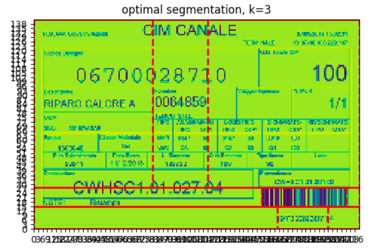
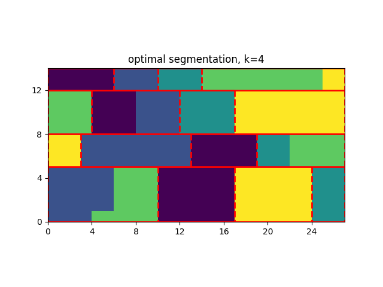

# k-segment coreset aka decision tree

current goal of this project is to segment an image

current state:
 - optimal algorithm for 2d array (matrix, image) - done
 - optimal algorithm with new const func - in works
 - 2d alg bicriteria - done
 - 2d balanced partition - in works

example results:

